# MariSoft-AIS Structures

## End-User Operating Procedure

Daily inspection, task, evidence, event, and anomaly workflow for **MariSoft-AIS Structures v11.0.0**.

| Document information | Value |
| --- | --- |
| Audience | Inspectors, engineers, reviewers, and workpack users |
| Document version | 1.0 |
| Effective date | 17 July 2026 |
| Status | Controlled operational guide |
| Original document | [End-User Operating Procedure (PDF)](./MariSoft-AIS_Structures_End-User_Operating_Procedure.pdf) |

## Contents

- [1. Purpose and operating rules](#1-purpose-and-operating-rules)
- [2. Interface at a glance](#2-interface-at-a-glance)
- [3. Standard operating sequence](#3-standard-operating-sequence)
- [4. Connect and load inspection data](#4-connect-and-load-inspection-data)
- [5. Navigate the inspection workspace](#5-navigate-the-inspection-workspace)
- [6. Perform and manage tasks](#6-perform-and-manage-tasks)
- [7. Work with video records](#7-work-with-video-records)
- [8. Record events](#8-record-events)
- [9. Manage anomalies and actions](#9-manage-anomalies-and-actions)
- [10. Save the workspace, back up, and export](#10-save-the-workspace-back-up-and-export)
- [11. Troubleshooting](#11-troubleshooting)
- [12. Session checklists](#12-session-checklists)
- [13. Support information to provide](#13-support-information-to-provide)

## 1. Purpose and operating rules

This procedure explains the standard end-user workflow in MariSoft-AIS Structures: connect to the correct data source, select the inspection context, perform task work, capture supporting evidence, manage events and anomalies, and close the session safely.

> [!IMPORTANT]
> Before adding or changing records, verify the **Server**, **Database**, **Asset**, **Schedule**, and **Workpack** values in the status bar.

### 1.1 Intended users

- Inspectors recording task progress and inspection observations.
- Engineers or reviewers checking events, anomalies, supporting media, and actions.
- Workpack users preparing, copying, exporting, or reviewing inspection data.

### 1.2 Before you begin

- Obtain the approved job folder and database file, or approved SQL Server connection details.
- Confirm which Region, Site, Asset, Schedule, and Workpack you must use.
- Ensure any required video folder, 3D model, point-cloud data, or documents are accessible.
- Do not create a new database, clone a workpack, delete records, or renumber anomalies unless your role authorizes it.

> [!NOTE]
> Available buttons and pages depend on connection state, workpack data, configuration, and user role. A disabled command is not necessarily an error.

## 2. Interface at a glance

Use these areas to orient yourself after the application opens.

| Area | What it contains | End-user purpose |
| --- | --- | --- |
| Top menu | Workspace, Database, DV Connection, Theme | Save the layout, back up/export data, and choose the display theme. |
| Left navigation | Database Connection, Inspection, Templates | Connect first; Inspection becomes available after data is loaded. |
| Inspection workspace | Asset tree, task data, video, events, anomalies, models | Perform and review inspection work in context. |
| Status bar | Server, database, asset, schedule, workpack, NodeJS status | Confirm that the correct operating context is active before editing. |

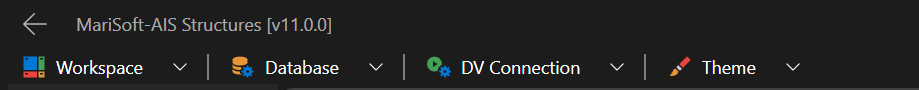

*Figure 1. Main application menu and version banner*

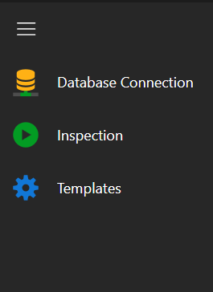

*Figure 2. Primary navigation panel*

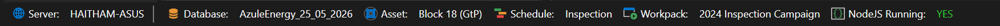

*Figure 3. Operating-context status bar*

## 3. Standard operating sequence

Use this sequence for a normal inspection or review session.

1. **Open the job folder.** On Database Connection, browse to or drop the approved job folder. Use the plus button only when a new standard folder structure is required.
2. **Connect to the data source.** Choose either Database File (`.db`) or SQL Server, provide the required details, and select the correct database.
3. **Select the operating context.** Choose Region, Site, Asset, Schedule, and Workpack in order. Later selections depend on earlier ones.
4. **Load the data.** Select **Load Data** and wait for processing to finish. Confirm the Inspection page becomes available.
5. **Verify the status bar.** Check the active server/database, asset, schedule, and workpack before editing any record.
6. **Perform or review work.** Use the inspection tree and Task Data tabs to work with tasks, videos, events, anomalies, evidence, documents, and models.
7. **Finish and safeguard.** End any active task, save completed edits, back up when required, and close only after long-running export or media operations finish.

## 4. Connect and load inspection data

The Database Connection page collects the job folder, data-source type, credentials or database file, and the location/workpack context. The example below shows a configured operating context; always use the values approved for your own assignment.

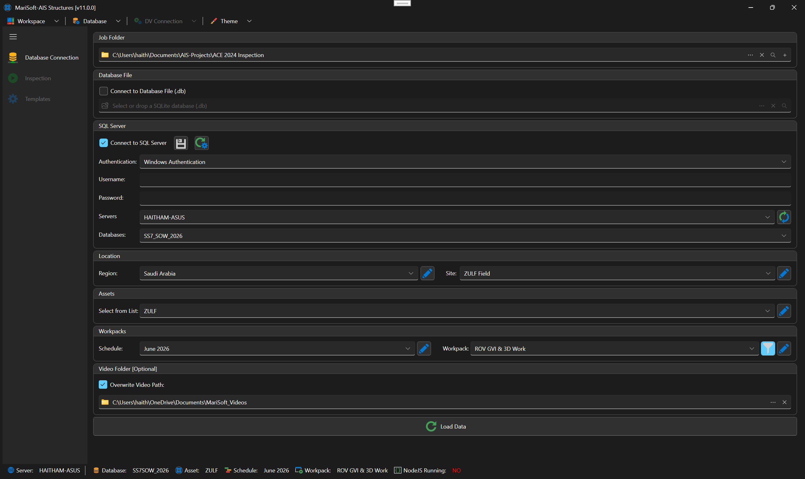

*Figure 4. Database Connection page and selected workpack context*

### 4.1 Connect to a SQLite database file

1. **Select Database File.** Tick **Connect to Database File (.db)**.
2. **Choose the file.** Browse to or drop the approved `.db` file into the database field.
3. **Select location and workpack.** Choose Region, Site, Asset, Schedule, and Workpack.
4. **Add video path if needed.** Use **Video Folder [Optional]** when media is stored separately. Apply **Overwrite Video Path** only when the approved media location has changed.
5. **Load Data.** Wait until the busy indicator clears, then verify the status bar.

### 4.2 Connect to SQL Server

1. **Select SQL Server.** Tick **Connect to SQL Server**.
2. **Choose authentication.** Select the approved authentication mode. Enter username and password only when SQL credentials are required.
3. **Choose server and database.** Refresh the server list if necessary, then select the approved server and database.
4. **Complete the context.** Select Region, Site, Asset, Schedule, and Workpack, then choose **Load Data**.

> [!WARNING]
> Never share database passwords or store them in an uncontrolled document. Use the save/load settings buttons only in accordance with local IT policy.

### 4.3 Connection acceptance check

- Inspection navigation is enabled.
- The status bar shows the expected server/database, asset, schedule, and workpack.
- The inspection tree and Task Data area display records expected for that workpack.
- If the context is wrong, stop and reconnect before entering data.

## 5. Navigate the inspection workspace

The inspection workspace links the asset/component hierarchy to operational data. Select a tree node first; the task, event, anomaly, evidence, document, and model views then operate in that context.

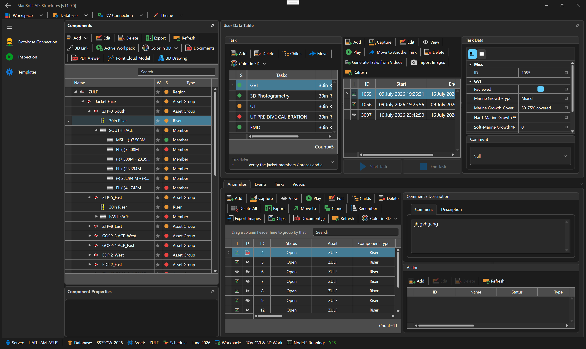

*Figure 5. Inspection workspace overview*

### 5.1 Work with the inspection tree

- Use **Expand Selected Node**, **Collapse Selected Node**, **Expand All Nodes**, or **Collapse All Nodes** to control the hierarchy.
- Select the correct asset/component node before adding or editing task-related data.
- Use **Add**, **Edit**, **Move**, and **Delete** only when maintaining the hierarchy is part of your role.
- Enable **Drag and Drop** only for deliberate tree maintenance; review the destination before saving tree changes.
- Use **3D Link** to associate the selected tree component with selected items in the open 3D drawing.

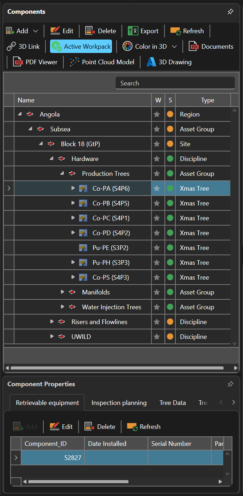

*Figure 6. Component hierarchy and component properties*

> [!CAUTION]
> Move, Delete, drag-and-drop, and 3D linking can change relationships used by other users. Confirm the selected node and destination before accepting.

### 5.2 Use drawings, models, and documents

- Open **3D Drawing** to view or select linked model items; **Color in 3D** highlights records using the chosen color.
- Use **Point Cloud Model** when point-cloud data is available for the selected context.
- Use **PDF Viewer** or **Documents** to open attached reference material.
- If a view is blank, confirm the selected component has a valid model/document link and that the source file is accessible.

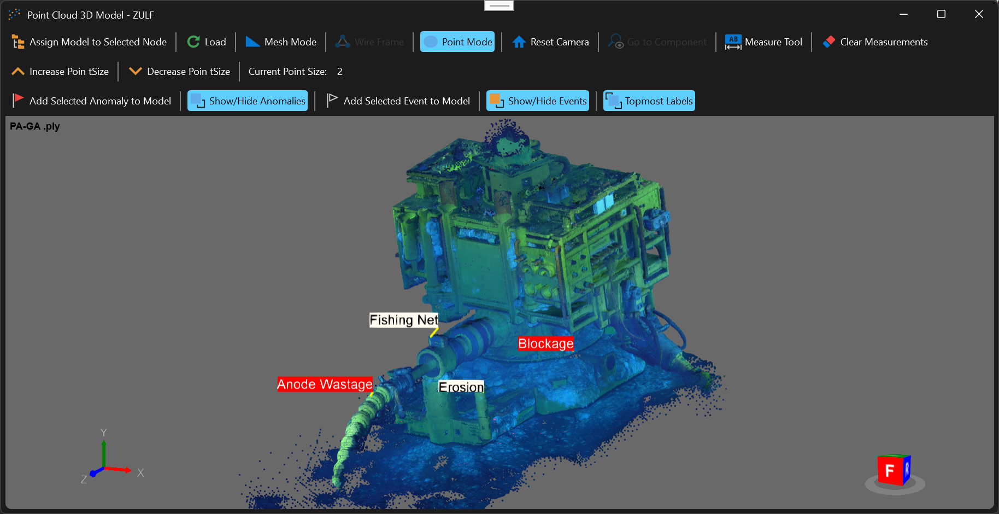

*Figure 7. Point-cloud model with anomaly and event labels*

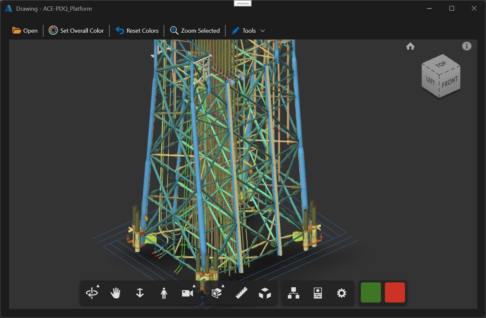

*Figure 9. Interactive 3D drawing view*

> [!NOTE]
> Confirm the title bar and selected component before assigning a model, adding labels, applying colors or measurements, or creating database links.

## 6. Perform and manage tasks

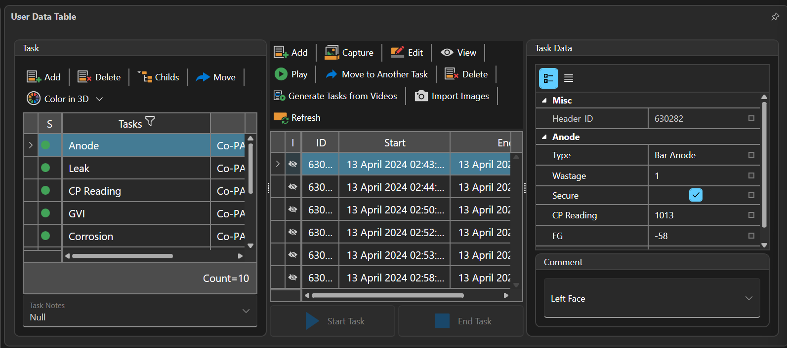

*Figure 10. Task selection, task records, and task data*

### 6.1 Start a task

1. **Select the component.** Choose the required node in the inspection tree.
2. **Select the task.** In Task Data or Tasks, select the correct task record. Confirm its component, type, and description.
3. **Start Task.** Choose **Start Task** to use the current time, or **Set Start Time** when an approved recorded time must be entered.
4. **Verify time and context.** Check the Start Time and confirm the task remains associated with the intended component.

### 6.2 Record evidence and notes

- Use **Capture** to take a task image from the available media source.
- Use **Import Images** for existing approved images; review the selected files before import.
- Use **Play** to open linked video. Use **Set time** where the current video position must be stored against a record.
- Use **Comment** or **Task Notes** for concise, factual inspection notes. Avoid unsupported conclusions.
- Use **Documents** to attach or open supporting files when required by the workpack procedure.

### 6.3 End a task

1. **Review the record.** Confirm notes and evidence are attached to the correct task and component.
2. **End Task.** Choose **End Task** to use the current time, or **Set End Time** for an approved recorded time.
3. **Check the time range.** Ensure End Time is later than Start Time and is consistent with the relevant video segment.
4. **Refresh if required.** Use **Refresh** to confirm the saved state shown in the grid.

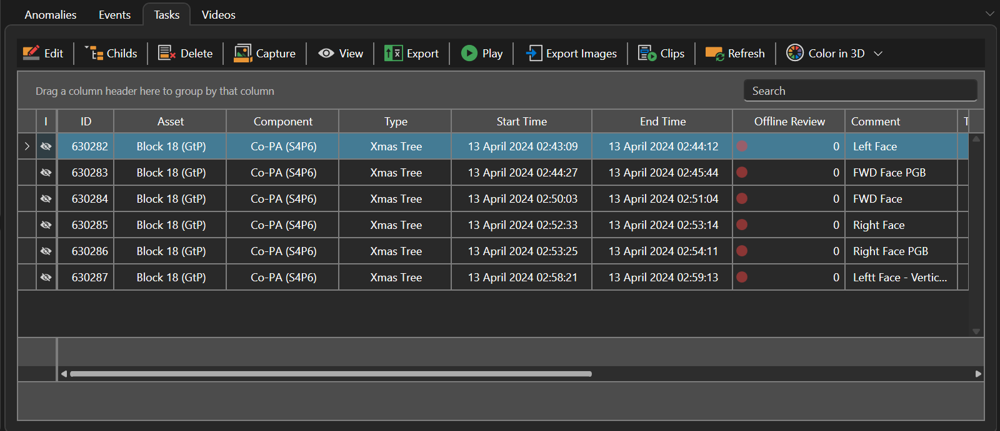

*Figure 11. Completed task records and review controls*

> [!IMPORTANT]
> Before closing the application or changing workpacks, end any task that has been completed. If work is genuinely continuing, follow the local shift-handover rule.

## 7. Work with video records

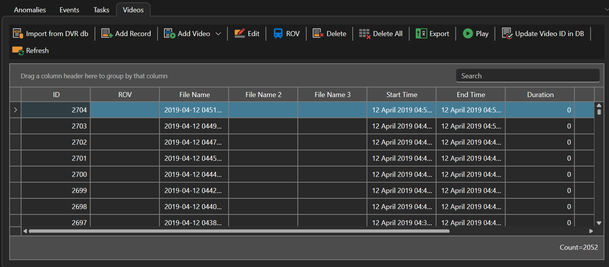

*Figure 12. Video records and media commands*

- Use **Add Video** to register an approved media file and **Add Record** when creating a database record without importing media.
- Confirm File Name, Dive No., ROV, Start Time, and End Time before using the record.
- Use **Play** for review and **Offline Review** when media must be reviewed without the live inspection workflow.
- Use **Import from DVR db** only for the supported source format selected in the interface, such as MariSoft, Nexus, Eiva, or VisualSoft.
- Use **Update Video ID in DB** only after confirming the target database and video set; wait for the update operation to finish.
- Use **Delete** or **Delete All** only with explicit authorization and after confirming that required evidence is preserved.

> [!TIP]
> If video does not open, first verify that the file path is accessible. Reconnecting with the correct Video Folder is safer than editing many records individually.

### 7.1 Remote DVR connection and logging

Use Remote DVR when the inspection workflow is configured to exchange commands and logging information with an approved DVR endpoint.

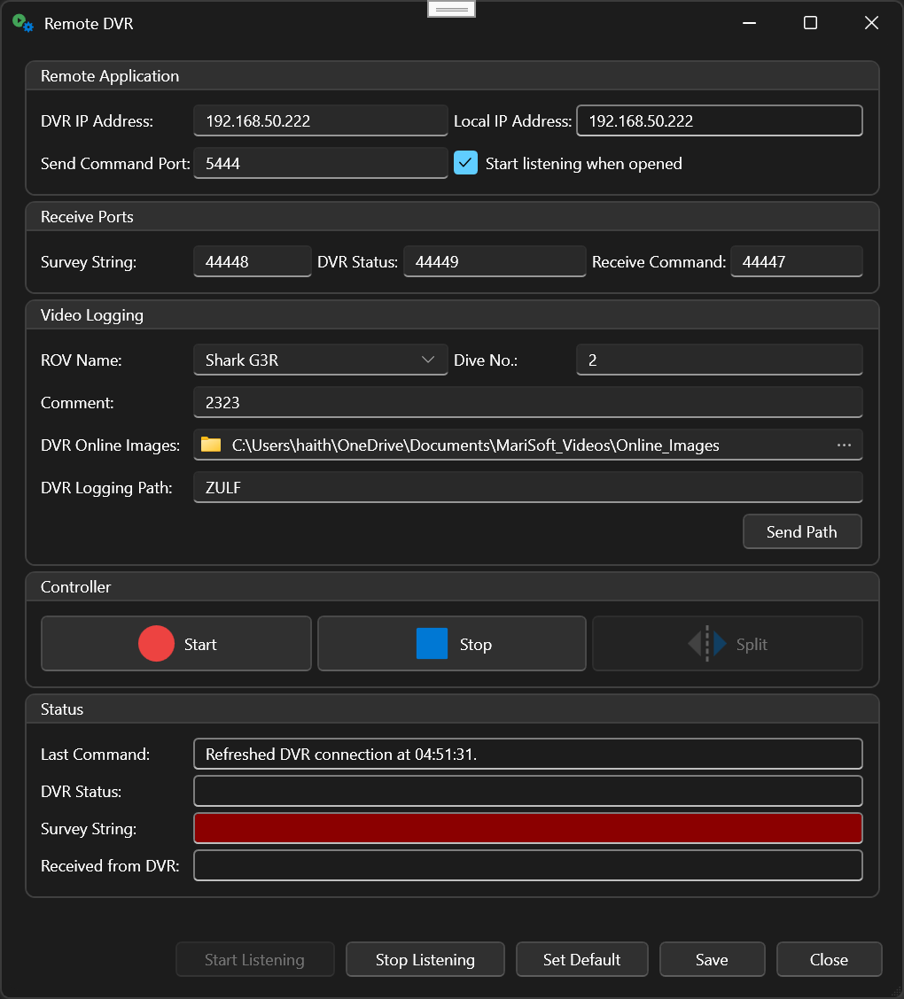

*Figure 13. Remote DVR connection, logging, and controller window*

- Verify the DVR IP address, local IP address, send-command port, and receive ports against the approved configuration.
- Select the correct ROV and Dive No., then confirm the online-image and DVR logging paths before sending a path or starting logging.
- Use **Start listening** when receiving DVR messages is required. Check the Status area for the last command, DVR status, survey string, and received data.
- Use **Start** and **Stop** to control the configured logging operation. Use **Split** only when the active workflow requires a file or recording split.
- Choose **Save** or **Set Default** only when authorized to change the stored Remote DVR configuration.

> [!WARNING]
> Do not change IP addresses, ports, logging paths, or default settings during an active inspection unless the approved DVR/network procedure requires the change.

## 8. Record events

An event is an inspection observation that may later require escalation to an anomaly.

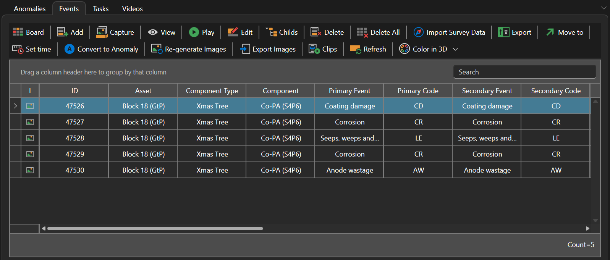

*Figure 14. Events tab and event-management commands*

1. **Select the component.** Choose the correct tree node and task context.
2. **Add the event.** Choose **Add**, then complete the applicable primary/secondary codes, comments, water depth, event date/time, and remedial action fields.
3. **Add evidence.** Use **Capture**, **Export Images**, **Clips**, or **Import Survey Data** as required. Confirm images and clips show the intended observation.
4. **Review and save.** Check the component, codes, time, and description before closing the edit form.
5. **Escalate if required.** Choose **Convert to Anomaly** only after review confirms the event requires anomaly tracking.

> [!IMPORTANT]
> Converting an event creates linked anomaly data. Confirm the selected event and answer the confirmation prompt carefully.

## 9. Manage anomalies and actions

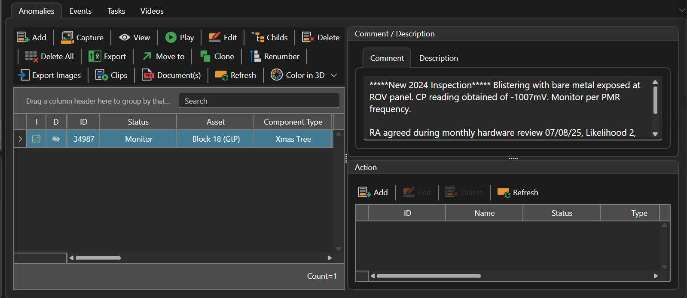

*Figure 15. Anomaly record, comments, and actions*

### 9.1 Create or edit an anomaly

1. **Open Anomalies.** Select the correct component and anomaly record, or choose **Add**.
2. **Complete the record.** Enter or verify code, description/comments, water depth, severity, risk, likelihood, status, year, and reference information as applicable.
3. **Attach supporting material.** Use **Capture**, **Export Images**, **Clips**, and **Document(s)** to collect or review evidence.
4. **Set status deliberately.** Use the status that matches the approved process, for example Open, Monitor, Referred, Remediate, or Concluded. Do not close an anomaly solely because media review is finished.
5. **Refresh and verify.** Confirm the saved anomaly remains attached to the correct component and workpack.

### 9.2 Record actions

- Select the anomaly, then use **Action** to add or review follow-up activity.
- Record a clear action description, responsible person or role when available, creation date, completion date, and status.
- Use **Action Before** when the action must be completed by a defined date.
- Mark an action complete only when the required evidence or confirmation is available.

### 9.3 High-impact anomaly commands

| Command | Use | Required check |
| --- | --- | --- |
| Clone | Create a similar anomaly record. | Change all copied fields that do not apply; confirm component and evidence links. |
| Move to | Associate the record with another valid destination. | Confirm destination component/workpack and downstream reporting impact. |
| Renumber | Regenerate anomaly name/reference using the configured code-number-year rule. | Use only under the approved numbering process; record the reason if local governance requires it. |
| Delete / Delete All | Remove eligible anomaly records. | Confirm the selected records and that related evidence or actions will not be lost. |

> [!CAUTION]
> Delete and bulk-delete commands display confirmation prompts. Read the prompt, confirm the record count, and select **No** if anything is unexpected.

## 10. Save the workspace, back up, and export

### 10.1 Workspace layout

- **Workspace > Save Workspace** stores the current pane/layout arrangement.
- **Workspace > Load Workspace** restores a saved arrangement.
- **Workspace > Reset Workspace** returns to the standard layout when panes are missing or unusable.
- **Theme > Apply Dark Theme** or **Apply Light Theme** changes appearance only; it does not change inspection data.

### 10.2 Database backup

1. **Confirm the database.** Verify the active database in the status bar.
2. **Choose Backup Database.** From the Database menu, select the backup command and choose the approved destination.
3. **Wait for completion.** Do not close the application or disconnect storage while the backup is running.
4. **Verify the result.** Confirm the success message and that the backup file exists in the intended folder.

### 10.3 Copy, clone, and export

- **Copy Workpack (All Data)** copies selected components, tasks, and selected related data between databases. Review source, destination, selected workpack, and options before Copy.
- **Clone Workpack (Empty Tasks)** creates the workpack/task structure without completed inspection data; use only for approved preparation workflows.
- **Export to Viewer** packages data for the supported viewer workflow.
- **Export to Nexus (Excel Sheets)** creates an Excel workbook for the chosen survey set, task types, components, and task data. If selected, task images are placed in an `Exported_Images` folder beside the workbook.
- Do not move or rename an exported workbook independently from its image folder when the workbook contains relative image references.

> [!IMPORTANT]
> Before any copy/export, confirm the active source database and workpack, destination path/database, selected records, and whether images, videos, findings, signoffs, anomalies, actions, and alarms are included.

## 11. Troubleshooting

| Symptom | What to check | Next action |
| --- | --- | --- |
| Inspection is disabled | A database has not been loaded, or connection failed. | Return to Database Connection, verify selections, and choose Load Data. |
| Expected workpack is missing | Region, Site, Asset, or Schedule may be wrong; the workpack may not exist in this database. | Recheck selections in order. Contact the workpack owner if still missing. |
| Grid is empty | Wrong tree node, filter/search text, or context; data may not exist. | Clear filters, select the intended node, and use Refresh. |
| Video will not play | File path, video folder, file availability, or codec/media support. | Verify access and reconnect with the approved Video Folder; contact support if the file itself fails. |
| 3D/point cloud is blank | The selected component may lack a valid link, or the source file is unavailable. | Verify the model is open, select the correct node, and check the link/path. |
| Cannot edit a record | No row/node selected, command disabled, insufficient role, or record state prevents editing. | Select the record and retry; otherwise contact the system administrator. |
| Export appears stuck | Large media sets can take time; a busy indicator may still be active. | Wait for completion. Do not start a second export or close the application. |
| Unexpected error message | Read the full message and note what action preceded it. | Stop repeated attempts; capture the message, database/workpack context, and steps for support. |

## 12. Session checklists

### 12.1 Start-of-session

- [ ] Open the approved job folder.
- [ ] Connect to the approved database file or SQL Server database.
- [ ] Select the correct Region, Site, Asset, Schedule, and Workpack.
- [ ] Load Data and verify every context value in the status bar.
- [ ] Confirm the required video/model/document paths are available.
- [ ] Select the correct component before starting work.

### 12.2 End-of-session

- [ ] End completed tasks and verify start/end times.
- [ ] Review that notes, events, anomalies, images, clips, and documents are linked to the correct records.
- [ ] Refresh key grids and confirm saved statuses.
- [ ] Complete the required backup or export and verify its destination.
- [ ] Ensure no copy, export, video-ID update, or media operation is still running.
- [ ] Record or hand over any incomplete task or unresolved error according to local procedure.

## 13. Support information to provide

When reporting a problem, provide enough context for support to reproduce it without exposing credentials:

- Application version shown in the title bar.
- Database name and whether the connection is a database file or SQL Server. **Do not send passwords.**
- Asset, Schedule, Workpack, selected component, and record ID where applicable.
- Exact command used and the sequence immediately before the problem.
- Full error text and a screenshot, with sensitive information removed.
- Whether the problem persists after Refresh or after reconnecting to the same approved context.

> [!WARNING]
> Share database files, exports, inspection media, and screenshots only through approved channels and only with authorized recipients.
